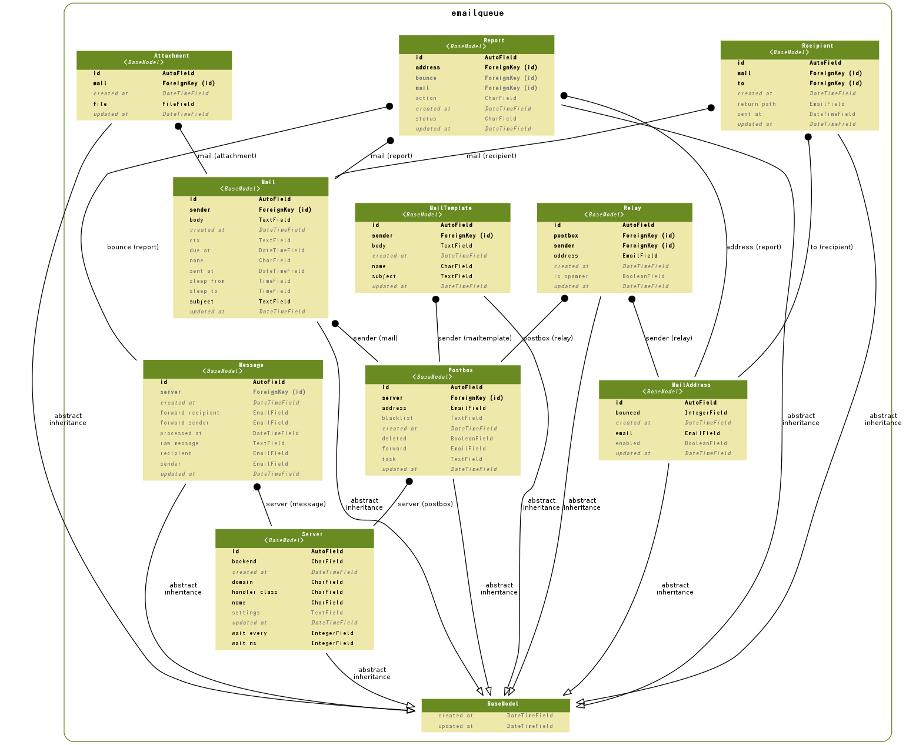

==================================================
 Email Delivery Subsystem
==================================================

.. contents::
    :local:

.. _emailqueue.models.Attachment:

Attachment:添付ファイル
==================================

.. autoclass:: emailqueue.models.Attachment
    :members:

.. list-table::

    *    - id
         - ID
         - integer AUTO_INCREMENT
         - 

    *    - created_at
         - 作成日時
         - datetime
         - 

    *    - updated_at
         - 更新日時
         - datetime
         - 

    *    - mail
         - メール
         - integer
         - メール

    *    - file
         - 添付ファイル
         - varchar(100)
         - 添付ファイル

.. include:: emailqueue.models.Attachment.rst

.. _emailqueue.models.BaseModel:

BaseModel:base model
========================================

.. autoclass:: emailqueue.models.BaseModel
    :members:

.. list-table::

    *    - created_at
         - 作成日時
         - datetime
         - 

    *    - updated_at
         - 更新日時
         - datetime
         - 

.. include:: emailqueue.models.BaseModel.rst

.. _emailqueue.models.Mail:

Mail:メール
================

.. autoclass:: emailqueue.models.Mail
    :members:

.. list-table::

    *    - id
         - ID
         - integer AUTO_INCREMENT
         - 

    *    - created_at
         - 作成日時
         - datetime
         - 

    *    - updated_at
         - 更新日時
         - datetime
         - 

    *    - sender
         - メール送信者
         - integer
         - 送信者

    *    - name
         - メール名称
         - varchar(50)
         - メール名称

    *    - subject
         - 表題
         - longtext
         - 表題

    *    - body
         - 本文
         - longtext
         - 本文

    *    - ctx
         - Context Data
         - longtext
         - Context Data Help

    *    - due_at
         - 送信予定
         - datetime
         - 送信予定

    *    - sleep_from
         - 停止開始時間
         - time
         - 停止開始時間

    *    - sleep_to
         - 停止終了時間
         - time
         - 停止終了時間

.. include:: emailqueue.models.Mail.rst

.. _emailqueue.models.MailAddress:

MailAddress:メールアドレス
======================================

.. autoclass:: emailqueue.models.MailAddress
    :members:

.. list-table::

    *    - id
         - ID
         - integer AUTO_INCREMENT
         - 

    *    - created_at
         - 作成日時
         - datetime
         - 

    *    - updated_at
         - 更新日時
         - datetime
         - 

    *    - email
         - メールアドレス
         - varchar(50)
         - メールアドレス

    *    - bounced
         - Bounced Count
         - integer
         - Bounced Count Help

    *    - enabled
         - Enabled Address
         - bool
         - Enabled Address Help

.. include:: emailqueue.models.MailAddress.rst

.. _emailqueue.models.MailTemplate:

MailTemplate:メールテンプレート
============================================

.. autoclass:: emailqueue.models.MailTemplate
    :members:

.. list-table::

    *    - id
         - ID
         - integer AUTO_INCREMENT
         - 

    *    - created_at
         - 作成日時
         - datetime
         - 

    *    - updated_at
         - 更新日時
         - datetime
         - 

    *    - sender
         - メール送信者
         - integer
         - 送信者

    *    - name
         - メール名称
         - varchar(50)
         - メール名称

    *    - subject
         - 表題
         - longtext
         - 表題

    *    - body
         - 本文
         - longtext
         - 本文

.. include:: emailqueue.models.MailTemplate.rst

.. _emailqueue.models.Message:

Message:Message
==============================

.. autoclass:: emailqueue.models.Message
    :members:

.. list-table::

    *    - id
         - ID
         - integer AUTO_INCREMENT
         - 

    *    - created_at
         - 作成日時
         - datetime
         - 

    *    - updated_at
         - 更新日時
         - datetime
         - 

    *    - server
         - Recipient Server
         - integer
         - 

    *    - sender
         - 送信者
         - varchar(100)
         - 送信者

    *    - recipient
         - 受信者
         - varchar(100)
         - 受信者

    *    - raw_message
         - メールメッセージデータ
         - longtext
         - メールメッセージデータ

    *    - forward_sender
         - Forwarding Sender
         - varchar(100)
         - Fowarding Sender Help

    *    - forward_recipient
         - Forwarding Recipient
         - varchar(100)
         - Forwarding Recipient Help

    *    - processed_at
         - 処理日時
         - datetime
         - 

.. include:: emailqueue.models.Message.rst

.. _emailqueue.models.Postbox:

Postbox:メール転送
==========================

.. autoclass:: emailqueue.models.Postbox
    :members:

.. list-table::

    *    - id
         - ID
         - integer AUTO_INCREMENT
         - 

    *    - created_at
         - 作成日時
         - datetime
         - 

    *    - updated_at
         - 更新日時
         - datetime
         - 

    *    - address
         - アドレス
         - varchar(50)
         - アドレス

    *    - forward
         - 転送先
         - varchar(50)
         - 転送先

    *    - deleted
         - 削除済み
         - bool
         - 削除済み

    *    - task
         - タスク
         - longtext
         - タスク

    *    - blacklist
         - ブラックリストパターン
         - longtext
         - ブラックリストパターン

.. include:: emailqueue.models.Postbox.rst

.. _emailqueue.models.Recipient:

Recipient:受信者
==========================

.. autoclass:: emailqueue.models.Recipient
    :members:

.. list-table::

    *    - id
         - ID
         - integer AUTO_INCREMENT
         - 

    *    - created_at
         - 作成日時
         - datetime
         - 

    *    - updated_at
         - 更新日時
         - datetime
         - 

    *    - mail
         - メール
         - integer
         - メール

    *    - to
         - 受信者アドレス
         - integer
         - 受信者アドレス

    *    - return_path
         - 戻りアドレス
         - varchar(50)
         - 戻りアドレス(Return_Path)

    *    - sent_at
         - 送信日時
         - datetime
         - 

.. include:: emailqueue.models.Recipient.rst

.. _emailqueue.models.Relay:

Relay:リレー記録
======================

.. autoclass:: emailqueue.models.Relay
    :members:

.. list-table::

    *    - id
         - ID
         - integer AUTO_INCREMENT
         - 

    *    - created_at
         - 作成日時
         - datetime
         - 

    *    - updated_at
         - 更新日時
         - datetime
         - 

    *    - address
         - Relay Address
         - varchar(50)
         - Relay Address Help

    *    - postbox
         - メール転送
         - integer
         - メール転送

    *    - sender
         - Sedner Address
         - integer
         - 送信者

    *    - is_spammer
         - スパマー
         - bool
         - 

.. include:: emailqueue.models.Relay.rst

.. _emailqueue.models.Report:

Report:Report
==========================

.. autoclass:: emailqueue.models.Report
    :members:

.. list-table::

    *    - id
         - ID
         - integer AUTO_INCREMENT
         - 

    *    - created_at
         - 作成日時
         - datetime
         - 

    *    - updated_at
         - 更新日時
         - datetime
         - 

    *    - address
         - メールアドレス
         - integer
         - Mail Address Help

    *    - mail
         - メール
         - integer
         - メール

    *    - bounce
         - Bounce Message
         - integer
         - Bounce Message Help

    *    - action
         - DNS Action
         - varchar(10)
         - DSN Action Help

    *    - status
         - DNS Status
         - varchar(10)
         - DSN Status Help

.. include:: emailqueue.models.Report.rst

.. _emailqueue.models.Server:

Server:Server
==========================

.. autoclass:: emailqueue.models.Server
    :members:

.. list-table::

    *    - id
         - ID
         - integer AUTO_INCREMENT
         - 

    *    - created_at
         - 作成日時
         - datetime
         - 

    *    - updated_at
         - 更新日時
         - datetime
         - 

    *    - name
         - メールサービス名
         - varchar(50)
         - 

    *    - domain
         - ドメイン名
         - varchar(50)
         - 

    *    - backend
         - バックエンド
         - varchar(100)
         - 

    *    - forwarder
         - Mail Forwarder
         - varchar(100)
         - 

.. include:: emailqueue.models.Server.rst

.. _emailqueue.models.er:

ER Diagram
============================

